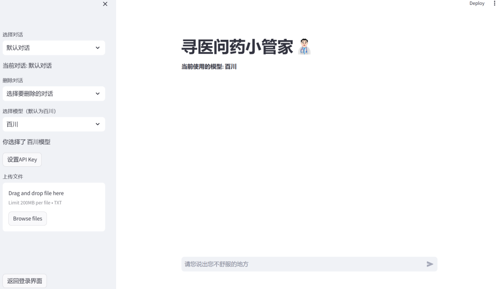

# LLM-projects
LLM based on langchain

# Seeking Medical Advice Project- Based On LLM 

## 1. Project Requirements Overview

### 1.1 Overview
The "Seeking Medical Advice and Medicine Butler" project aims to provide users with a convenient and intelligent medical consultation service platform through advanced artificial intelligence technology. The system is mainly divided into three modules:
- **Intelligent Q&A Interaction**: The system interacts with users through intelligent Q&A models to provide medical consultation and suggestions.
- **Medical Database Management**: Administrators can query, modify, add and delete medical databases.
- **User Management**: The system provides user login, registration and user information management functions.

The system is designed based on the Streamlit framework. The client is responsible for interface design and interaction, and the server is responsible for data management and query result return.

### 1.2 Main Functions
The design of the medical large model Q&A system includes the following modules:
| Serial number | Module name | Main function |
| ---- | ------------------ | ------------------------------------------------------------------------ |
| 1 | User management module | Realize user login, registration and information management. |
| 2 | Question and answer interactive management module | Supports users to select large models, intelligent diagnosis, file upload diagnosis, and multiple dialogue window functions. |
| 3 | Medical database management module | Data crawling and sorting, MySQL database connection. |

### 1.3 Operating environment

#### 1. Software environment

| Category | Name | Version | Language |
| --------------- | ---------------------- | ---------- | ----------- |
| Operating system | Windows/Linux | 7+/centos7 | Simplified Chinese |
| Database platform | MySQL | 5+ | Simplified Chinese |
| Development tool | Visual Studio Code | 1.91.1.0 | |
| Framework | None | | |

#### 2. Hardware environment

| Development computer | Minimum configuration | Recommended configuration |
| ------------- | --------------------- | ----------------------- |
| CPU | Intel i5 | Intel i5 and above |
| Memory | 16G | 16G |

## 2. Functional requirements

### 2.1 Login and registration

#### 2.1.1 Login
- **Requirement number**: AIbot_001
- **Function name**: Login
- **Function description**: The user enters the username and password, which are sent to the server for verification. If the verification is successful, the user enters the large model response interface; if the user is not registered, the user is prompted to register.

#### 2.1.2 Registration
- **Requirement number**: AIbot_002
- **Function name**: Registration
- **Function description**: The user enters the username and password, which are sent to the server to verify the uniqueness of the username. If the verification is successful, the user creates an account and stores the password in encrypted form.

### 2.2 Large model switching

#### 2.2.1 Self-selected large model
- **Requirement number**: AIbot_003
- **Function name**: Self-selected large model
- **Function description**: The user selects the large model type, and the system verifies and loads the corresponding model for question-and-answer interaction.

#### 2.2.2 Intelligent diagnosis
- **Requirement number**: AIbot_004
- **Function name**: Intelligent diagnosis
- **Function description**: The user enters the description of the disease, and the system calls the selected large model for diagnosis and returns the result.

#### 2.2.3 File upload diagnosis function
- **Requirement number**: AIbot_005
- **Function name**: File upload diagnosis function
- **Function description**: The user uploads medical-related documents, and the system reads the file content and sends it to the large model for analysis.

#### 2.2.4 Multiple dialogue windows
- **Requirement number**: AIbot_006
- **Function name**: Multiple dialogue windows
- **Function description**: Provide multiple independent dialogue windows, and users can conduct medical consultations in different windows at the same time.

## 3. Non-functional requirements

### 3.1 Front-end requirements

#### 3.1.1 Start interface
- **Requirement number**: UI_001
- **Function name**: Start interface
- **Function description**: The interface displays the welcome message "Welcome to the medical consultation manager" and displays relevant theme pictures. Users can click "Start using" to enter the system.

#### 3.1.2 Login interface
- **Requirement number**: UI_002
- **Function name**: Login interface
- **Function description**: The user enters the user name and password for identity authentication. If the authentication is successful, the main interface is entered. Otherwise, an error message is prompted.

#### 3.1.3 Registration interface
- **Requirement number**: UI_003
- **Function name**: Registration interface
- **Function description**: The user enters the user name and password, and the system verifies whether the user name is unique and creates a new user.

#### 3.1.4 Main interface sidebar
- **Requirement number**: UI_004
- **Function name**: Main interface sidebar
- **Function description**: Provide users with options such as creating or selecting dialog windows, switching large models, and uploading files.

#### 3.1.5 Main interface dialog bar
- **Requirement number**: UI_005
- **Function name**: Main interface dialog bar
- **Function description**: Users enter questions or upload files, and the system processes and displays diagnostic results.
  

#### 3.1.6 Settings interface
- **Requirement number**: UI_006
- **Function name**: Settings interface
- **Function description**: Provide API Key input and large model switching functions.

### 3.2 Backend requirements

#### 3.2.1 Data download and collation
- **Requirement number**: Database_001
- **Function name**: Data download and collation
- **Function description**: Download medical data sources and convert them into usable formats, and update data regularly.

#### 3.2.2 MySQL connection
- **Requirement number**: Database_002
- **Function name**: MySQL connection
- **Function description**: Process data addition, deletion, modification and query operations to ensure data security and performance.

## 4. Project summary

### 4.1 Project overview
"Xunyiwenyao Xiaoguanjia" provides users with intelligent medical consultation services through the Streamlit framework. The system design revolves around three core modules: intelligent question-and-answer interaction, user management, and medical database management.

### 4.2 Project results
- Realize intelligent question-and-answer interaction, support large model switching, intelligent diagnosis, file upload diagnosis and other functions.
- Complete user management functions to ensure user data security.
- The medical database management module supports data crawling and MySQL connection.

### 4.3 Technical Implementation
The project uses Streamlit for network programming. The client is responsible for interface interaction, and the server processes data and returns query results.

### 4.4 Functional Highlights
- Supports users to select large models.
- Realizes intelligent diagnosis function.
- Supports file upload diagnosis of medical documents.
- Provides independent consulting services in multiple dialogue windows.
